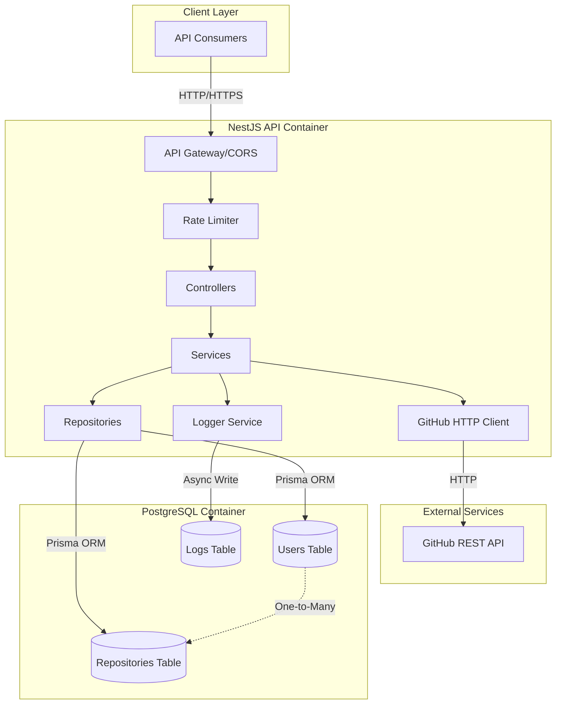
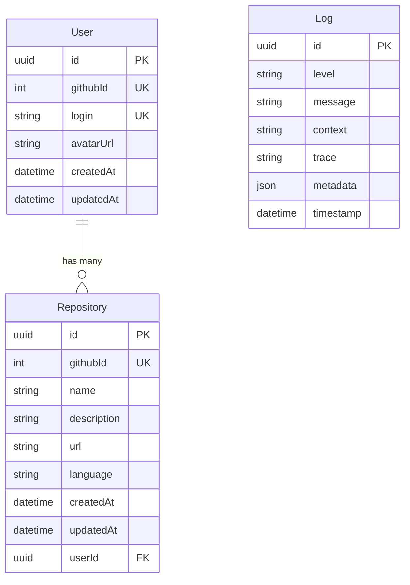
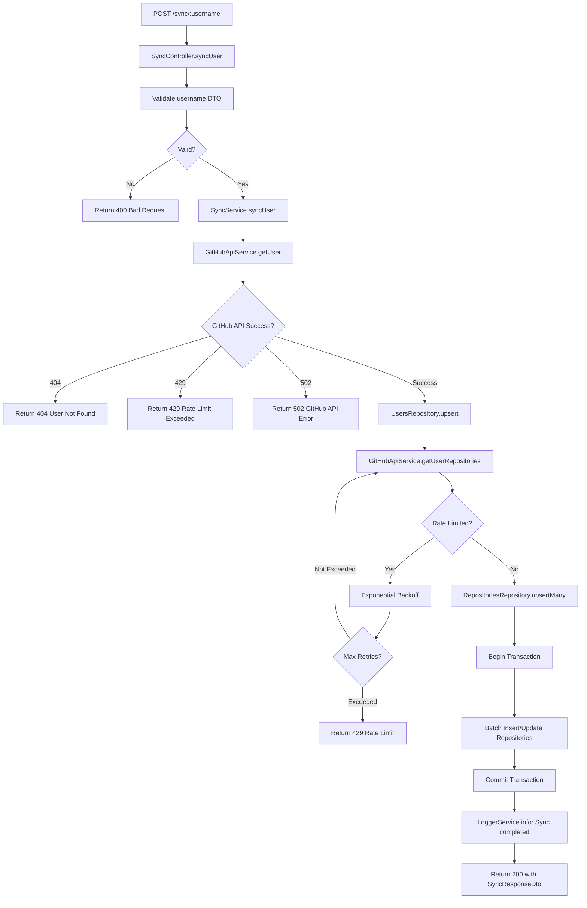
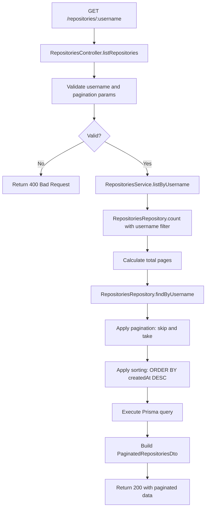
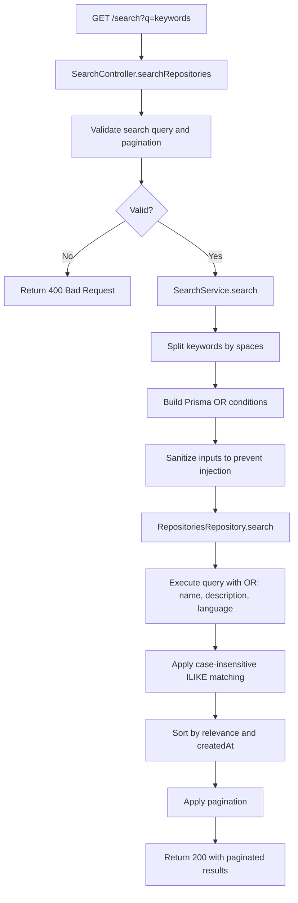
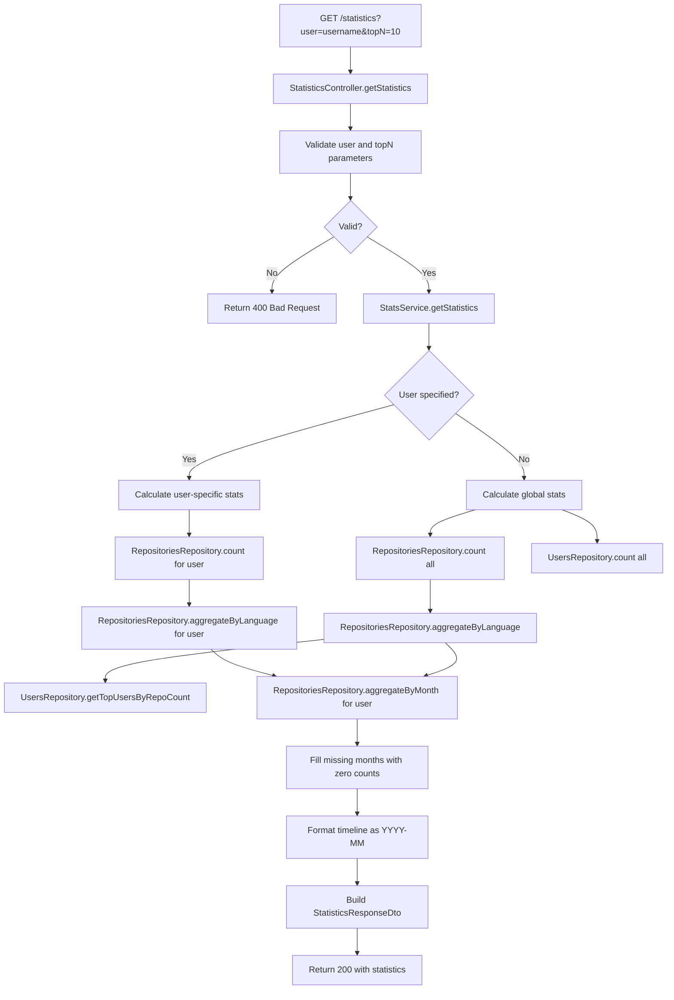
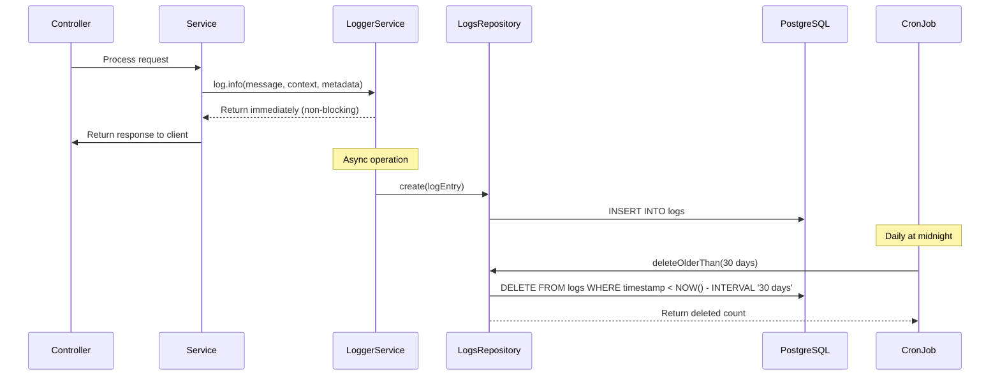
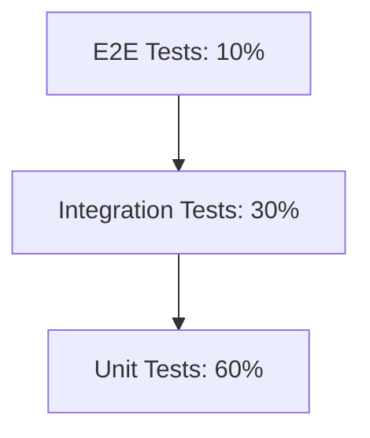

# Design Document: GitHub Repository Management API

## Overview

### Design Goal
Design a scalable, maintainable RESTful API that synchronizes GitHub repository data to a local PostgreSQL database, providing enhanced search, listing, and statistical analysis capabilities. The system will serve as an intermediary layer between GitHub's public API and client applications, offering persistent storage, advanced querying, and analytical insights.

### Scope
This design covers:
- Four REST API endpoints (sync, list, search, statistics)
- NestJS-based layered architecture with TypeScript
- PostgreSQL database with Prisma ORM
- Docker containerization with Docker Compose orchestration
- Comprehensive API documentation (Swagger/OpenAPI, README, VitePress)
- Async database logging system with 30-day retention
- Security measures including CORS, rate limiting, and input validation
- Testing strategy targeting 70% code coverage

### Key Design Principles
- **Separation of Concerns**: Clear layered architecture (Controllers → Services → Repositories)
- **Type Safety**: TypeScript and Prisma for compile-time type checking
- **Resilience**: Exponential backoff for GitHub API, transaction handling for data consistency
- **Performance**: Database indexing, connection pooling, pagination
- **Observability**: Structured async logging to PostgreSQL

## Architecture Design

### System Architecture Diagram



### Data Flow Diagram

```mermaid
graph TB
    subgraph Synchronization Flow
        S1[Client Request: POST /sync/:username] --> S2[SyncController]
        S2 --> S3[SyncService.syncUser]
        S3 --> S4{Fetch User from GitHub}
        S4 -->|Success| S5[Upsert User to DB]
        S4 -->|Error| S6[Return Error Response]
        S5 --> S7{Fetch Repos from GitHub}
        S7 -->|Success| S8[Batch Upsert Repos to DB]
        S7 -->|Rate Limit| S9[Exponential Backoff]
        S9 --> S7
        S8 --> S10[Return Sync Summary]
    end

    subgraph Search Flow
        R1[Client Request: GET /search?q=keyword] --> R2[SearchController]
        R2 --> R3[SearchService.search]
        R3 --> R4[Build Prisma Query with OR conditions]
        R4 --> R5[Execute Query with Pagination]
        R5 --> R6[Return Paginated Results]
    end

    subgraph Statistics Flow
        T1[Client Request: GET /stats?user=username] --> T2[StatsController]
        T2 --> T3[StatsService.getStatistics]
        T3 --> T4[Aggregate Queries: Count, Group By, Date Histogram]
        T4 --> T5[Calculate Rankings and Timeline]
        T5 --> T6[Return Statistics Object]
    end
```



## Component Design

### 1. Controllers Layer

#### SyncController
**Responsibilities:**
- Handle POST /sync/:username endpoint
- Validate username input via DTO
- Delegate synchronization to SyncService
- Return HTTP responses with appropriate status codes

**Interfaces:**
```typescript
@Controller('sync')
export class SyncController {
  @Post(':username')
  async syncUser(@Param() params: SyncUserDto): Promise<SyncResponseDto>
}
```

**Dependencies:**
- SyncService
- LoggerService

---

#### RepositoriesController
**Responsibilities:**
- Handle GET /repositories/:username endpoint
- Validate query parameters for pagination
- Delegate repository listing to RepositoriesService
- Return paginated repository data

**Interfaces:**
```typescript
@Controller('repositories')
export class RepositoriesController {
  @Get(':username')
  async listRepositories(
    @Param() params: ListReposDto,
    @Query() query: PaginationDto
  ): Promise<PaginatedRepositoriesDto>
}
```

**Dependencies:**
- RepositoriesService
- LoggerService

---

#### SearchController
**Responsibilities:**
- Handle GET /search endpoint
- Validate search query and pagination parameters
- Delegate search logic to SearchService
- Return paginated search results

**Interfaces:**
```typescript
@Controller('search')
export class SearchController {
  @Get()
  async searchRepositories(
    @Query() query: SearchQueryDto
  ): Promise<PaginatedRepositoriesDto>
}
```

**Dependencies:**
- SearchService
- LoggerService

---

#### StatisticsController
**Responsibilities:**
- Handle GET /statistics endpoint
- Validate user and topN query parameters
- Delegate statistics calculation to StatisticsService
- Return statistics object

**Interfaces:**
```typescript
@Controller('statistics')
export class StatisticsController {
  @Get()
  async getStatistics(
    @Query() query: StatsQueryDto
  ): Promise<StatisticsResponseDto>
}
```

**Dependencies:**
- StatisticsService
- LoggerService

---

### 2. Services Layer

#### SyncService
**Responsibilities:**
- Orchestrate user and repository synchronization from GitHub
- Call GitHubApiService to fetch data
- Call UsersRepository and RepositoriesRepository to persist data
- Handle concurrency with transaction locks
- Implement exponential backoff retry logic

**Interfaces:**
```typescript
export class SyncService {
  async syncUser(username: string): Promise<SyncResult>
  private async upsertUser(userData: GitHubUser): Promise<User>
  private async upsertRepositories(repos: GitHubRepo[], userId: string): Promise<number>
}
```

**Dependencies:**
- GitHubApiService
- UsersRepository
- RepositoriesRepository
- PrismaService (for transactions)
- LoggerService

---

#### RepositoriesService
**Responsibilities:**
- Retrieve repositories for a specific user from database
- Apply pagination and sorting (by creation date DESC)
- Calculate pagination metadata

**Interfaces:**
```typescript
export class RepositoriesService {
  async listByUsername(username: string, pagination: PaginationParams): Promise<PaginatedResult<Repository>>
}
```

**Dependencies:**
- RepositoriesRepository
- LoggerService

---

#### SearchService
**Responsibilities:**
- Build search queries with OR conditions across multiple fields
- Implement case-insensitive partial matching
- Apply relevance sorting (exact matches first, then partial)
- Handle pagination

**Interfaces:**
```typescript
export class SearchService {
  async search(keywords: string, pagination: PaginationParams): Promise<PaginatedResult<Repository>>
  private buildSearchConditions(keywords: string[]): Prisma.RepositoryWhereInput
}
```

**Dependencies:**
- RepositoriesRepository
- LoggerService

---

#### StatisticsService
**Responsibilities:**
- Calculate global or user-specific statistics
- Aggregate repository counts by language
- Compute top users by repository count
- Generate monthly creation timeline histogram
- Handle topN parameter validation and capping

**Interfaces:**
```typescript
export class StatisticsService {
  async getStatistics(user?: string, topN?: number): Promise<Statistics>
  private async calculateLanguageDistribution(user?: string): Promise<Record<string, number>>
  private async calculateTopUsers(topN: number): Promise<TopUser[]>
  private async calculateTimeline(user?: string): Promise<Record<string, number>>
}
```

**Dependencies:**
- RepositoriesRepository
- UsersRepository
- LoggerService

---

#### GitHubApiService
**Responsibilities:**
- Make HTTP requests to GitHub REST API
- Handle rate limiting with exponential backoff
- Parse and validate GitHub API responses
- Manage GitHub API errors (404, 502, 429)

**Interfaces:**
```typescript
export class GitHubApiService {
  async getUser(username: string): Promise<GitHubUser>
  async getUserRepositories(username: string): Promise<GitHubRepo[]>
  private async retryWithBackoff<T>(operation: () => Promise<T>, maxRetries: number): Promise<T>
}
```

**Dependencies:**
- HttpService (from @nestjs/axios)
- ConfigService
- LoggerService

---

#### LoggerService
**Responsibilities:**
- Provide structured logging interface
- Write logs asynchronously to PostgreSQL
- Support multiple log levels (debug, info, warn, error)
- Format logs in JSON structure
- Include context and metadata

**Interfaces:**
```typescript
export class LoggerService {
  debug(message: string, context?: string, metadata?: Record<string, any>): void
  info(message: string, context?: string, metadata?: Record<string, any>): void
  warn(message: string, context?: string, metadata?: Record<string, any>): void
  error(message: string, trace?: string, context?: string, metadata?: Record<string, any>): void
  private async writeToDatabase(logEntry: LogEntry): Promise<void>
}
```

**Dependencies:**
- LogsRepository
- ConfigService

---

### 3. Repositories Layer

#### UsersRepository
**Responsibilities:**
- Abstract database operations for Users table
- Implement upsert (insert or update) logic
- Provide query methods for user retrieval

**Interfaces:**
```typescript
export class UsersRepository {
  async upsert(userData: CreateUserDto): Promise<User>
  async findByUsername(username: string): Promise<User | null>
  async findById(id: string): Promise<User | null>
  async getTopUsersByRepoCount(limit: number): Promise<TopUser[]>
}
```

**Dependencies:**
- PrismaService

---

#### RepositoriesRepository
**Responsibilities:**
- Abstract database operations for Repositories table
- Implement batch upsert for multiple repositories
- Provide advanced query methods with filtering, sorting, pagination
- Execute aggregation queries for statistics

**Interfaces:**
```typescript
export class RepositoriesRepository {
  async upsertMany(repos: CreateRepositoryDto[]): Promise<number>
  async findByUsername(username: string, pagination: PaginationParams): Promise<Repository[]>
  async search(keywords: string[], pagination: PaginationParams): Promise<Repository[]>
  async count(filters?: RepositoryFilters): Promise<number>
  async aggregateByLanguage(user?: string): Promise<LanguageCount[]>
  async aggregateByMonth(user?: string): Promise<MonthlyCount[]>
}
```

**Dependencies:**
- PrismaService

---

#### LogsRepository
**Responsibilities:**
- Abstract database operations for Logs table
- Implement async log insertion
- Provide log cleanup method for retention policy

**Interfaces:**
```typescript
export class LogsRepository {
  async create(logEntry: CreateLogDto): Promise<void>
  async deleteOlderThan(days: number): Promise<number>
}
```

**Dependencies:**
- PrismaService

---

### 4. Infrastructure Components

#### PrismaService
**Responsibilities:**
- Extend PrismaClient with NestJS lifecycle hooks
- Manage database connection pooling
- Provide transaction support

**Interfaces:**
```typescript
export class PrismaService extends PrismaClient implements OnModuleInit, OnModuleDestroy {
  async onModuleInit(): Promise<void>
  async onModuleDestroy(): Promise<void>
}
```

---

#### RateLimitGuard
**Responsibilities:**
- Implement rate limiting middleware
- Track request counts per IP or API key
- Return 429 status when limit exceeded

**Interfaces:**
```typescript
@Injectable()
export class RateLimitGuard implements CanActivate {
  canActivate(context: ExecutionContext): boolean | Promise<boolean>
}
```

**Dependencies:**
- CacheModule (for in-memory rate limit storage)

---

#### GlobalExceptionFilter
**Responsibilities:**
- Catch all unhandled exceptions
- Transform exceptions to structured error responses
- Log errors without exposing sensitive information

**Interfaces:**
```typescript
@Catch()
export class GlobalExceptionFilter implements ExceptionFilter {
  catch(exception: unknown, host: ArgumentsHost): void
}
```

**Dependencies:**
- LoggerService

---

## Data Model

### Prisma Schema

```prisma
// schema.prisma

generator client {
  provider = "prisma-client-js"
}

datasource db {
  provider = "postgresql"
  url      = env("DATABASE_URL")
}

model User {
  id           String       @id @default(uuid())
  githubId     Int          @unique @map("github_id")
  login        String       @unique
  avatarUrl    String       @map("avatar_url")
  createdAt    DateTime     @default(now()) @map("created_at")
  updatedAt    DateTime     @updatedAt @map("updated_at")
  repositories Repository[]

  @@index([login])
  @@map("users")
}

model Repository {
  id          String   @id @default(uuid())
  githubId    Int      @unique @map("github_id")
  name        String
  description String?
  url         String
  language    String?
  createdAt   DateTime @map("created_at")
  updatedAt   DateTime @default(now()) @map("updated_at")
  userId      String   @map("user_id")
  user        User     @relation(fields: [userId], references: [id], onDelete: Cascade)

  @@index([userId])
  @@index([name])
  @@index([language])
  @@index([createdAt])
  @@map("repositories")
}

model Log {
  id        String   @id @default(uuid())
  level     String
  message   String
  context   String?
  trace     String?
  metadata  Json?
  timestamp DateTime @default(now())

  @@index([timestamp])
  @@index([level])
  @@map("logs")
}
```

### Entity Relationships



### Key Design Decisions

1. **UUID Primary Keys**: Using UUID instead of auto-increment integers for better distributed system compatibility and security (no ID enumeration).

2. **GitHub ID Uniqueness**: Enforce unique constraints on `githubId` to prevent duplicate syncs and enable efficient upsert operations.

3. **Cascade Delete**: When a User is deleted, all associated repositories are automatically deleted (onDelete: Cascade).

4. **Indexes Strategy**:
   - `userId` in repositories for fast user-based queries
   - `name` for search operations
   - `language` for statistics aggregation
   - `createdAt` for timeline queries and sorting
   - `timestamp` and `level` in logs for efficient log retrieval and cleanup

5. **Optional Fields**: `description` and `language` are nullable since GitHub repositories may not have these fields.

6. **JSON Metadata**: Logs use JSON field for flexible metadata storage without schema changes.

---

## Business Process

### Process 1: Repository Synchronization



### Process 2: Repository Listing with Pagination



### Process 3: Repository Search



### Process 4: Statistics Calculation



### Process 5: Async Logging with Retention



---

## Error Handling Strategy

### Error Categories and HTTP Status Codes

| Error Type | HTTP Status | Scenario | Response Format |
|------------|-------------|----------|-----------------|
| Validation Error | 400 | Invalid input parameters (missing username, invalid topN) | `{ "statusCode": 400, "message": ["username should not be empty"], "error": "Bad Request" }` |
| Not Found | 404 | GitHub user not found | `{ "statusCode": 404, "message": "GitHub user not found", "error": "Not Found" }` |
| Rate Limit Exceeded | 429 | GitHub API rate limit or internal rate limit | `{ "statusCode": 429, "message": "Rate limit exceeded", "error": "Too Many Requests" }` |
| Bad Gateway | 502 | GitHub API error or timeout | `{ "statusCode": 502, "message": "GitHub API is unavailable", "error": "Bad Gateway" }` |
| Internal Server Error | 500 | Unexpected errors (database failure, etc.) | `{ "statusCode": 500, "message": "Internal server error", "error": "Internal Server Error" }` |

### Exception Handling Layers

1. **Validation Layer (DTOs with class-validator)**
   - Validate all inputs before processing
   - Return 400 with detailed validation errors

2. **Service Layer**
   - Catch specific errors (GitHub API errors, database errors)
   - Transform to custom exceptions (NotFoundException, BadGatewayException)
   - Log errors with full context

3. **Global Exception Filter**
   - Catch all unhandled exceptions
   - Format consistent error responses
   - Log errors without exposing stack traces to clients
   - Sanitize error messages to prevent information leakage

### Retry and Resilience Patterns

1. **Exponential Backoff for GitHub API**
   - Initial delay: 1 second
   - Multiplier: 2
   - Max retries: 5
   - Jitter: ±20% random variation

2. **Transaction Rollback**
   - Wrap batch operations in Prisma transactions
   - Automatic rollback on failure
   - Prevent partial data corruption

3. **Circuit Breaker (Future Enhancement)**
   - Stop calling GitHub API after consecutive failures
   - Return cached data or error immediately
   - Resume after cooldown period

### Logging Strategy for Errors

```typescript
// Example error logging
this.logger.error(
  'Failed to sync user repositories',
  error.stack,
  'SyncService',
  {
    username,
    githubStatusCode: error.response?.status,
    retryCount: 3,
    requestId: context.requestId
  }
);
```

---

## Testing Strategy

### Testing Pyramid



### 1. Unit Tests (60% of test suite)

**Target: 70% code coverage for service and repository layers**

**SyncService Unit Tests:**
- Test `syncUser` with mocked GitHubApiService and repositories
- Test upsert logic for existing and new users
- Test batch repository upsert
- Test exponential backoff retry logic
- Test error handling for GitHub API failures

**SearchService Unit Tests:**
- Test keyword splitting and OR condition building
- Test case-insensitive matching logic
- Test relevance sorting
- Test pagination calculation

**StatisticsService Unit Tests:**
- Test global vs. user-specific statistics
- Test topN parameter validation and capping
- Test language aggregation
- Test timeline histogram with missing months filled

**Tools:**
- Jest (default NestJS test runner)
- @nestjs/testing for dependency injection mocking
- jest.mock for external dependencies

**Example:**
```typescript
describe('SyncService', () => {
  let service: SyncService;
  let githubApiService: jest.Mocked<GitHubApiService>;
  let usersRepository: jest.Mocked<UsersRepository>;

  beforeEach(async () => {
    const module = await Test.createTestingModule({
      providers: [
        SyncService,
        { provide: GitHubApiService, useValue: mockGitHubApiService },
        { provide: UsersRepository, useValue: mockUsersRepository },
      ],
    }).compile();

    service = module.get(SyncService);
  });

  it('should sync user and repositories successfully', async () => {
    // Arrange
    githubApiService.getUser.mockResolvedValue(mockGitHubUser);
    githubApiService.getUserRepositories.mockResolvedValue(mockRepos);

    // Act
    const result = await service.syncUser('octocat');

    // Assert
    expect(result.repositoriesCount).toBe(5);
    expect(usersRepository.upsert).toHaveBeenCalled();
  });
});
```

---

### 2. Integration Tests (30% of test suite)

**Target: Test API endpoints with real database (test container)**

**Setup:**
- Use TestContainers or Docker Compose with test database
- Apply Prisma migrations before tests
- Seed test data
- Clean database after each test

**Test Scenarios:**
- POST /sync/:username with mocked GitHub API
- GET /repositories/:username with seeded data
- GET /search with various keyword combinations
- GET /statistics with global and user-specific parameters
- Test pagination across all endpoints
- Test rate limiting behavior

**Tools:**
- Supertest for HTTP assertions
- @testcontainers/postgresql for isolated test database
- nock for mocking GitHub API HTTP calls

**Example:**
```typescript
describe('RepositoriesController (e2e)', () => {
  let app: INestApplication;

  beforeAll(async () => {
    // Start test container and initialize app
  });

  it('/repositories/:username (GET)', async () => {
    // Seed test data
    await seedUser('testuser', 10 repos);

    return request(app.getHttpServer())
      .get('/repositories/testuser?page=1&pageSize=5')
      .expect(200)
      .expect((res) => {
        expect(res.body.data).toHaveLength(5);
        expect(res.body.pagination.totalPages).toBe(2);
      });
  });
});
```

---

### 3. E2E Tests (10% of test suite)

**Target: Test critical user workflows end-to-end**

**Workflows:**
1. Sync a GitHub user → List repositories → Search repositories
2. Sync multiple users → Get global statistics
3. Rate limiting enforcement → Verify 429 errors

**Environment:**
- Full Docker Compose setup
- Real PostgreSQL container
- Mock GitHub API server or use test GitHub account

---

### 4. Test Coverage Requirements

**Minimum Coverage Targets:**
- Overall: 70%
- Services: 80%
- Repositories: 75%
- Controllers: 60%

**Coverage Exclusions:**
- Main.ts (bootstrap file)
- Configuration files
- DTOs (simple data classes)
- Prisma generated client

**Commands:**
```bash
# Run all tests with coverage
npm run test:cov

# Run integration tests
npm run test:e2e

# Watch mode for development
npm run test:watch
```

---

### 5. Testing Best Practices

1. **Arrange-Act-Assert Pattern**: Structure all tests clearly
2. **Test Isolation**: Each test should be independent and idempotent
3. **Descriptive Test Names**: Use "should [expected behavior] when [condition]"
4. **Mock External Dependencies**: Never call real GitHub API in tests
5. **Test Error Paths**: Test failure scenarios, not just happy paths
6. **Performance Tests**: Verify response times for large datasets
7. **Database Cleanup**: Reset database state between tests

---

## Security Considerations

### 1. Input Validation and Sanitization
- Use class-validator decorators on all DTOs
- Sanitize search keywords to prevent SQL injection
- Validate username format (alphanumeric, hyphens only)
- Cap topN parameter to prevent resource exhaustion

### 2. CORS Configuration
```typescript
app.enableCors({
  origin: [
    'http://localhost:3000',
    'http://localhost:5173',
    'http://localhost:8080',
    process.env.ALLOWED_ORIGIN || '*'
  ],
  credentials: true,
  methods: ['GET', 'POST'],
});
```

### 3. Rate Limiting
- Implement @nestjs/throttler
- Default: 100 requests per 15 minutes per IP
- Configurable via environment variables

### 4. Secrets Management
- Store GitHub API token (if needed) in .env
- Never commit .env files to version control
- Use Docker secrets in production

### 5. Logging Security
- Never log sensitive data (tokens, passwords)
- Sanitize error messages before sending to clients
- Store logs in database with access controls

### 6. Database Security
- Use parameterized queries (Prisma handles this)
- Enforce least privilege for database user
- Enable SSL for database connections in production

---

## Performance Optimization

### 1. Database Optimization
- **Indexes**: Applied on frequently queried fields (userId, name, language, createdAt)
- **Connection Pooling**: Configure Prisma connection pool (default: 10 connections)
- **Batch Operations**: Use upsertMany for repository synchronization

### 2. API Response Times
- Listing: < 2s for 1000 repositories
- Search: < 3s for 10,000 repositories
- Statistics: < 5s for 100,000 repositories

### 3. Caching Strategy (Future Enhancement)
- Cache GitHub user data for 1 hour
- Cache statistics for 15 minutes
- Use Redis for distributed caching

### 4. Async Processing
- Logging writes are asynchronous (non-blocking)
- Consider job queues (Bull) for long-running syncs

---

## Deployment Architecture

### Docker Compose Configuration

```yaml
services:
  api:
    build: .
    ports:
      - "3000:3000"
    environment:
      - DATABASE_URL=postgresql://user:pass@db:5432/github_api
      - NODE_ENV=production
    depends_on:
      - db
    healthcheck:
      test: ["CMD", "curl", "-f", "http://localhost:3000/health"]
      interval: 30s
      timeout: 10s
      retries: 3

  db:
    image: postgres:16-alpine
    ports:
      - "5432:5432"
    environment:
      - POSTGRES_USER=user
      - POSTGRES_PASSWORD=pass
      - POSTGRES_DB=github_api
    volumes:
      - postgres_data:/var/lib/postgresql/data
    healthcheck:
      test: ["CMD-SHELL", "pg_isready -U user"]
      interval: 10s
      timeout: 5s
      retries: 5

volumes:
  postgres_data:
```

### Multi-Stage Dockerfile

```dockerfile
# Build stage
FROM node:20-alpine AS builder
WORKDIR /app
COPY package*.json ./
RUN npm ci
COPY . .
RUN npm run build
RUN npx prisma generate

# Production stage
FROM node:20-alpine
WORKDIR /app
COPY --from=builder /app/dist ./dist
COPY --from=builder /app/node_modules ./node_modules
COPY --from=builder /app/package*.json ./
COPY prisma ./prisma
EXPOSE 3000
CMD ["sh", "-c", "npx prisma migrate deploy && node dist/main"]
```

---

## Documentation Plan

### 1. Swagger/OpenAPI
- Auto-generated from DTOs and decorators
- Accessible at `/api/docs`
- Include examples for all endpoints
- Document all error responses

### 2. README.md
- Project overview and features
- Quick start with Docker Compose
- Environment variables reference
- API endpoints summary
- Development setup
- Testing commands

### 3. VitePress Documentation
- Architecture overview with diagrams
- API reference (embedded Swagger)
- Development guide
- Deployment guide
- Contributing guidelines
- Troubleshooting

---

## Future Enhancements

1. **Authentication & Authorization**: Add API keys or OAuth for protected endpoints
2. **Webhooks**: Listen to GitHub webhooks for real-time synchronization
3. **Advanced Search**: Full-text search with Elasticsearch
4. **Data Export**: Export statistics to CSV/JSON
5. **GraphQL API**: Alternative query interface
6. **Monitoring**: Prometheus metrics and Grafana dashboards
7. **Job Queues**: Background sync jobs with Bull/BullMQ

---

## Appendix: Technology Stack Summary

| Component | Technology | Version | Purpose |
|-----------|-----------|---------|---------|
| Runtime | Node.js | 20.x | JavaScript runtime |
| Language | TypeScript | 5.x | Type-safe development |
| Framework | NestJS | 10.x | Application framework |
| ORM | Prisma | 5.x | Database toolkit |
| Database | PostgreSQL | 16.x | Data persistence |
| Validation | class-validator | 0.14.x | Input validation |
| HTTP Client | Axios | 1.x | GitHub API calls |
| Testing | Jest | 29.x | Unit/Integration tests |
| API Docs | Swagger | 7.x | API documentation |
| Containerization | Docker | 24.x | Application packaging |
| Orchestration | Docker Compose | 2.x | Multi-container setup |
| Docs Site | VitePress | 1.x | Static documentation |

---

## Conclusion

This design provides a robust, scalable foundation for the GitHub Repository Management API. The layered architecture ensures maintainability, while Prisma and PostgreSQL deliver type-safe, performant data access. Docker containerization enables consistent deployments across environments. The comprehensive testing strategy and async logging system ensure reliability and observability. Security measures including rate limiting, CORS, and input validation protect the API from common vulnerabilities. The design satisfies all 12 requirement categories and positions the system for future enhancements.
