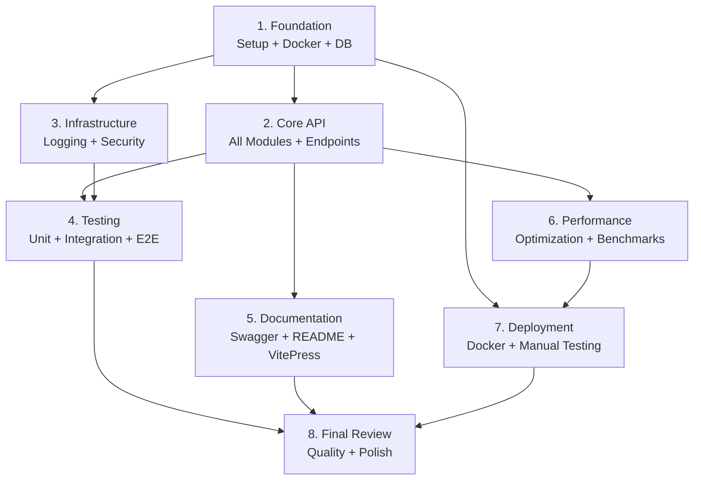

# Implementation Tasks: GitHub Repository Management API

## Task Overview

**Total Tasks:** 8 (highly consolidated)
**Estimated Effort:** 5-7 days
**Target:** Fully functional API with 70% test coverage

---

## 1. Project Foundation (Setup + Docker + Database)
- [x] Initialize NestJS project with TypeScript, ESLint, Prettier, and all dependencies (Prisma, class-validator, @nestjs/swagger, @nestjs/throttler, @nestjs/schedule)
- [x] Create multi-stage Dockerfile and docker-compose.yml with PostgreSQL and API services
- [x] Configure health checks, volumes, networking, and automatic Prisma migrations
- [x] Define Prisma schema (User, Repository, Log models) with relationships, constraints, and indexes
- [x] Create and test initial migration
- [x] Implement PrismaModule and PrismaService with connection pooling
- [x] Set up environment configuration with validation

_Requirements: 5.1-5.3, 5.6, 5.10, 6.1-6.8, 7.1-7.8, 11.4_

---

## 2. Core API Implementation (All Modules + Endpoints)
- [x] **GitHub Module:** Create GithubModule/Service with API calls, retry logic, rate limit detection
- [x] **Users Module:** Create UsersModule/Service with upsert logic and transaction support
- [x] **Repositories Module:** Create module/service/controller with:
  - POST `/api/repositories/sync/:username` - Sync GitHub repos
  - GET `/api/repositories/list/:username` - List with pagination
  - GET `/api/repositories/search` - Search with relevance ordering and pagination
- [x] **Statistics Module:** Create module/service/controller with:
  - GET `/api/statistics` - Calculate summary, languages, timeline, top users
- [x] Create all DTOs with class-validator decorators
- [x] Handle concurrent requests, transactions, and NULL values

_Requirements: 1.1-1.10, 2.1-2.8, 3.1-3.12, 4.1-4.18, 5.7, 5.8_

---

## 3. Infrastructure & Cross-Cutting (Logging, Security, Error Handling)
- [x] **Logging System:** Create LoggerModule/Service with async database logging, structured JSON, request ID/correlation ID, startup logging, and cron job for 30-day retention cleanup
- [x] **Exception Handling:** Create global exception filter for HTTP and Prisma errors with structured responses
- [x] **Interceptors:** Create logging interceptor for request/response logging with response times
- [x] **Security:** Configure rate limiting (100 req/min), CORS (localhost + env config), helmet middleware, input validation/sanitization

_Requirements: 5.9, 9.1-9.6, 12.1-12.11_

---

## 4. Testing & Quality (Unit + Integration + E2E)
- [x] Write unit tests for all services (Repositories, GitHub, Statistics, Logger) with mocked dependencies
- [x] Write integration tests for all API endpoints with test database and transaction rollback
- [x] Write E2E tests for complete flows and error scenarios (404, 429, 502, 400)
- [x] Configure Jest coverage reporting and achieve minimum 70% coverage
- [x] Mock GitHub API responses in all tests

_Requirements: 10.1-10.5_

---

## 5. Documentation (Swagger + README + VitePress)
- [x] Configure Swagger/OpenAPI with @ApiTags, @ApiOperation, @ApiResponse decorators on all controllers and DTOs
- [x] Enable Swagger UI at `/api/docs`
- [x] Write comprehensive README.md with: overview, tech stack, prerequisites, setup instructions, Docker commands, environment variables, API endpoints, testing commands, project structure
- [x] Initialize VitePress in `/docs` folder with architecture, API, development, and deployment guides
- [x] Add npm scripts: `docs:dev` and `docs:build`

_Requirements: 8.1-8.9_

---

## 6. Performance & Optimization
- [x] Verify all database indexes are created correctly
- [x] Implement skip/take pagination with metadata (total, page, limit, totalPages) in all list endpoints
- [x] Test and optimize performance benchmarks:
  - List: < 2s for 1000 repos
  - Search: < 3s for 10k repos
  - Statistics: < 5s for 100k repos
- [x] Test with 100 concurrent requests (response time degradation < 2x baseline)
- [x] Implement batch processing with Promise.all for parallel repository upserts

_Requirements: 2.6-2.8, 3.9-3.11, 4.17, 7.7, 11.1, 11.2, 11.5_

---

## 7. Deployment & Testing
- [x] Build and test Docker image (verify multi-stage optimization)
- [x] Test docker-compose up (both containers start, PostgreSQL health check, API waits, migrations run automatically)
- [x] Verify volume persistence (data survives container restart)
- [x] Create `/health` endpoint for container monitoring
- [x] Manual E2E testing with real GitHub users
- [x] Load testing with 100 concurrent requests
- [x] Test all error scenarios and large datasets (1000+ repos)

_Requirements: 6.4, 6.8, all performance and error handling requirements_

---

## 8. Final Review & Polish
- [x] Run ESLint and Prettier, fix all issues
- [x] Review all TypeScript types (eliminate `any` types)
- [x] Verify all functions have proper error handling
- [x] Test README.md instructions completeness
- [x] Verify Swagger UI functionality
- [x] Build and test VitePress documentation
- [x] Test all documented commands
- [x] Final code quality review

_Requirements: Code quality and documentation standards_

---

## Tasks Dependency Diagram



---

## Execution Strategy (3 Phases)

### Phase 1: Build (Day 1-4)
**Tasks: 1, 2, 3**
- Day 1: Foundation (project setup, Docker, database)
- Day 2-3: Core API (all modules and endpoints)
- Day 3-4: Infrastructure (logging, security, error handling)

### Phase 2: Validate (Day 4-6)
**Tasks: 4, 5, 6**
- Day 4-5: Testing (unit, integration, E2E, 70% coverage)
- Day 5: Documentation (Swagger, README, VitePress)
- Day 5-6: Performance (optimization and benchmarks)

### Phase 3: Deploy (Day 6-7)
**Tasks: 7, 8**
- Day 6-7: Deployment testing and load testing
- Day 7: Final review and polish

---

## Definition of Done

A task is considered complete when:

1. ✅ All subtasks are implemented and working correctly
2. ✅ Tests are passing (unit, integration, E2E where applicable)
3. ✅ Code follows TypeScript/NestJS best practices
4. ✅ ESLint and Prettier checks pass
5. ✅ Documentation is complete and accurate
6. ✅ Manual testing confirms full functionality
7. ✅ All related requirements are satisfied

---

## Quick Reference

### Key Commands
```bash
# Development
npm run start:dev

# Testing
npm run test           # Unit tests
npm run test:e2e       # E2E tests
npm run test:cov       # Coverage report

# Docker
docker-compose up -d   # Start containers
docker-compose down    # Stop containers
docker-compose logs -f # View logs

# Documentation
npm run docs:dev       # VitePress dev server
npm run docs:build     # Build VitePress

# Database
npx prisma migrate dev # Run migrations
npx prisma studio      # Database GUI
npx prisma generate    # Generate client
```

### Performance Targets
- **List endpoint:** < 2s for 1000 repos
- **Search endpoint:** < 3s for 10k repos
- **Statistics endpoint:** < 5s for 100k repos
- **Concurrent load:** 100 requests without > 2x degradation

### Coverage Target
- **Minimum 70% code coverage** across all modules

### Tech Stack
- **Runtime:** Node.js 18+
- **Language:** TypeScript
- **Framework:** NestJS
- **Database:** PostgreSQL 16
- **ORM:** Prisma
- **Containers:** Docker + Docker Compose
- **Documentation:** Swagger/OpenAPI + VitePress
- **Testing:** Jest + Supertest

---

## Critical Implementation Notes

### Must-Have Features
1. ✅ 4 REST endpoints (sync, list, search, statistics)
2. ✅ PostgreSQL + Prisma ORM
3. ✅ Docker + Docker Compose (2 containers)
4. ✅ Async database logging with 30-day retention
5. ✅ Rate limiting and CORS configuration
6. ✅ 70% test coverage
7. ✅ Swagger + README + VitePress documentation

### Key Quality Standards
- **Type Safety:** No `any` types, full TypeScript coverage
- **Error Handling:** Global exception filter, structured error responses
- **Security:** Input validation, SQL injection prevention, rate limiting
- **Performance:** Pagination, indexing, batch processing
- **Testing:** Mock external dependencies, use test database
- **Documentation:** Keep docs synchronized with code changes
