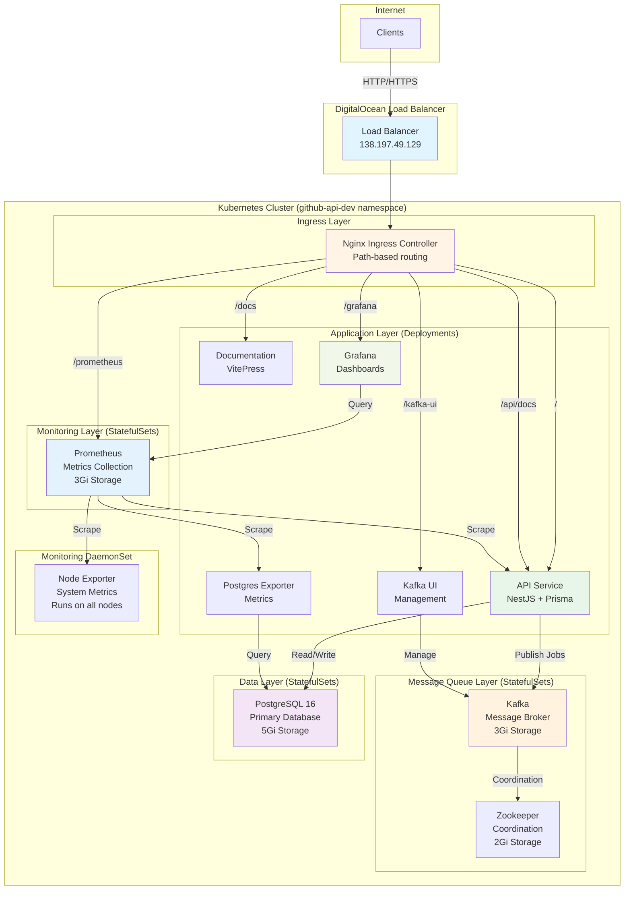

# Architecture

This document provides an overview of the GitHub Repository Management API's system architecture and design decisions.

## System Overview

The application follows a **layered architecture** pattern using NestJS modules, providing clear separation of concerns and maintainability.

```
┌─────────────────────────────────────────────────────────┐
│                     Client Layer                         │
│              (REST API Consumers)                        │
└─────────────────────────────────────────────────────────┘
                          │
                          ▼
┌─────────────────────────────────────────────────────────┐
│                   API Gateway Layer                      │
│        (NestJS Controllers + Middleware)                 │
│  - Rate Limiting  - CORS  - Helmet  - Validation        │
└─────────────────────────────────────────────────────────┘
                          │
                          ▼
┌─────────────────────────────────────────────────────────┐
│                   Service Layer                          │
│              (Business Logic)                            │
│  - RepositoriesService  - StatisticsService              │
└─────────────────────────────────────────────────────────┘
                          │
                   ┌──────┴──────┐
                   ▼              ▼
         ┌──────────────┐ ┌──────────────┐
         │   Database   │ │ External API │
         │  (Prisma)    │ │  (GitHub)    │
         │  PostgreSQL  │ │              │
         └──────────────┘ └──────────────┘
```

## Technology Stack

### Backend Framework
- **NestJS** - Progressive Node.js framework with TypeScript
- **Node.js 18+** - JavaScript runtime

### Database
- **PostgreSQL 16** - Relational database
- **Prisma** - Type-safe ORM with migrations

### External Services
- **GitHub REST API v3** - Repository data source

### Infrastructure
- **Docker** - Containerization
- **Docker Compose** - Local development orchestration
- **Kubernetes** - Production container orchestration (DigitalOcean)
- **Prometheus** - Metrics collection
- **Grafana** - Metrics visualization
- **Kafka** - Message queue for async jobs
- **Zookeeper** - Kafka coordination

## Module Structure

The application is organized into the following NestJS modules:

### Core Modules

#### App Module (`src/app.module.ts`)
Root module that imports and configures all feature modules.

#### Repositories Module (`src/modules/repositories/`)
Handles repository synchronization, listing, and search operations.

**Components:**
- `RepositoriesController` - HTTP endpoints
- `RepositoriesService` - Business logic
- `GithubService` - GitHub API integration
- DTOs for request/response validation

#### Statistics Module (`src/modules/statistics/`)
Provides analytics and insights from repository data.

**Components:**
- `StatisticsController` - HTTP endpoints
- `StatisticsService` - Statistical computations
- DTOs for response formatting

#### Logger Module (`src/modules/logger/`)
Custom logging with database persistence and correlation IDs.

**Features:**
- Async database logging
- Correlation ID tracking
- Structured JSON output
- 30-day retention policy

### Shared Components

#### Database Module (`src/modules/database/`)
Prisma client initialization and database connection management.

#### Common (`src/common/`)
Shared DTOs, decorators, and utilities used across modules.

## Data Flow

### Repository Sync Flow

```
1. Client Request
   POST /api/repositories/sync/octocat
        │
        ▼
2. RepositoriesController
   - Validates username
   - Calls service
        │
        ▼
3. RepositoriesService
   - Calls GithubService
        │
        ▼
4. GithubService
   - Fetches from GitHub API
   - Paginates results
        │
        ▼
5. RepositoriesService
   - Transforms data
   - Upserts to database
        │
        ▼
6. Response
   Returns count and metadata
```

### Search Flow

```
1. Client Request
   GET /api/repositories/search?q=typescript
        │
        ▼
2. RepositoriesController
   - Validates query params
   - Calls service
        │
        ▼
3. RepositoriesService
   - Executes full-text search
   - Applies pagination
        │
        ▼
4. Prisma
   - Queries PostgreSQL
   - Returns results
        │
        ▼
5. Response
   Returns paginated results
```

## Database Schema

### Repository Table

```sql
model Repository {
  id               Int       @id @default(autoincrement())
  githubId         Int       @unique
  name             String
  fullName         String
  owner            String
  description      String?
  url              String
  language         String?
  stargazersCount  Int
  forksCount       Int
  openIssuesCount  Int
  watchersCount    Int
  createdAt        DateTime
  updatedAt        DateTime
  pushedAt         DateTime?
  size             Int
  hasIssues        Boolean
  hasProjects      Boolean
  hasDownloads     Boolean
  hasWiki          Boolean
  hasPages         Boolean
  archived         Boolean
  disabled         Boolean
  visibility       String
  defaultBranch    String
  syncedAt         DateTime  @default(now())

  @@index([owner])
  @@index([language])
  @@index([createdAt])
}
```

### Log Table

```sql
model Log {
  id            Int      @id @default(autoincrement())
  level         String
  message       String
  context       String?
  metadata      Json?
  correlationId String?
  timestamp     DateTime @default(now())

  @@index([correlationId])
  @@index([timestamp])
}
```

## Security Architecture

### Request Security
- **Helmet** - Sets security HTTP headers
- **CORS** - Configurable origin whitelist
- **Rate Limiting** - 100 requests/minute per IP
- **Input Validation** - Class-validator on all DTOs

### Data Security
- **SQL Injection Protection** - Prisma parameterized queries
- **XSS Protection** - Content Security Policy headers
- **HTTPS Ready** - TLS termination support

## Scalability Considerations

### Horizontal Scaling
- **Stateless Design** - No session storage
- **Database Connection Pooling** - Prisma manages connections
- **Container Ready** - Easy to replicate with Docker

### Performance Optimization
- **Database Indexes** - On frequently queried fields
- **Pagination** - All list endpoints support pagination
- **Caching Strategy** - Local database reduces GitHub API calls

### Future Enhancements
- Response caching for frequently accessed data
- Read replicas for scaling database reads
- API response caching with ETags

## Monitoring and Observability

### Logging
- Structured JSON logs
- Correlation IDs for request tracing
- Database-persisted logs with 30-day retention
- Configurable log levels
- Kubernetes pod logs accessible via kubectl

### Metrics Collection
- **Prometheus** - Collects metrics from multiple sources:
  - API application metrics (HTTP requests, latency, errors)
  - PostgreSQL metrics (connections, queries, performance)
  - Node metrics (CPU, memory, disk, network)
  - Kubernetes cluster metrics
- **Exporters**:
  - Postgres Exporter - Database-specific metrics
  - Node Exporter - System-level metrics (DaemonSet on all nodes)

### Visualization
- **Grafana Dashboards**:
  - API Overview Dashboard - Request rates, latency percentiles (p50, p95, p99), response codes, error rates
  - Business Metrics Dashboard - Repository sync stats, search queries, GitHub API usage
  - Access: http://138.197.49.129/grafana/ (admin/admin)

### Health Checks
- PostgreSQL connection health check
- Kubernetes liveness and readiness probes on all pods
- Service endpoint health monitoring

## Deployment Architecture

### Development
```
Local Machine
├── Node.js (development mode)
└── PostgreSQL (Docker)
```

### Production (Kubernetes)

The production deployment runs on **DigitalOcean Kubernetes** with a comprehensive infrastructure:



**Infrastructure Components:**

1. **Ingress Layer**
   - Nginx Ingress Controller for path-based routing
   - Single external IP (138.197.49.129)
   - Routes to multiple backend services

2. **Application Tier** (Deployments - Stateless)
   - API: NestJS REST API (1 replica, scalable)
   - Docs: VitePress documentation (1 replica)
   - Grafana: Metrics visualization (1 replica)
   - Kafka UI: Message queue management (1 replica)
   - Postgres Exporter: Database metrics (1 replica)

3. **Monitoring Tier** (StatefulSets - Stateful)
   - Prometheus: Metrics storage and collection (3Gi persistent volume)
   - Node Exporter: System metrics (DaemonSet on all nodes)

4. **Message Queue Tier** (StatefulSets - Stateful)
   - Kafka: Message broker for async jobs (3Gi persistent volume)
   - Zookeeper: Kafka cluster coordination (2Gi persistent volume)

5. **Data Tier** (StatefulSets - Stateful)
   - PostgreSQL 16: Primary database (5Gi persistent volume)
   - Automated backups via CronJobs

**Service Endpoints:**
- API: http://138.197.49.129/
- Swagger UI: http://138.197.49.129/api/docs
- Documentation: http://138.197.49.129/docs
- Grafana: http://138.197.49.129/grafana/
- Prometheus: http://138.197.49.129/prometheus
- Kafka UI: http://138.197.49.129/kafka-ui/

**Storage:**
- Total: 16Gi persistent storage
- Storage Class: DigitalOcean Block Storage
- Backup Strategy: Automated CronJobs for PostgreSQL

**Scaling:**
- Horizontal Pod Autoscaling configured for API and Docs
- StatefulSets for data persistence and ordered deployment
- DaemonSets ensure monitoring on all nodes

For detailed Kubernetes deployment instructions, see [Kubernetes Deployment Guide](/kubernetes-deployment).

## Design Patterns

### Repository Pattern
Prisma acts as the repository layer, abstracting database operations.

**Why chosen:**
- **Database abstraction** - Allows switching between different databases without changing business logic
- **Type safety** - Prisma provides compile-time type checking and auto-completion
- **Migration management** - Built-in schema versioning and migration tools
- **Query optimization** - Prisma generates optimized SQL queries automatically
- **Testability** - Easy to mock database operations in unit tests

### Service Layer Pattern
Business logic separated from controllers for testability.

**Why chosen:**
- **Separation of concerns** - Controllers handle HTTP, services handle business logic
- **Reusability** - Services can be used by multiple controllers or other services
- **Testability** - Business logic can be tested independently of HTTP layer
- **Maintainability** - Changes to business logic don't affect routing or HTTP handling
- **Single Responsibility** - Each service has a clear, focused purpose

### Dependency Injection
NestJS DI container manages all dependencies.

**Why chosen:**
- **Loose coupling** - Components depend on interfaces, not concrete implementations
- **Testability** - Easy to inject mock dependencies in tests
- **Lifecycle management** - NestJS automatically manages object creation and cleanup
- **Flexibility** - Can easily swap implementations without changing dependent code
- **Best practice** - Industry-standard pattern for enterprise applications

### DTO Pattern
Data Transfer Objects for request/response validation and transformation.

**Why chosen:**
- **Type safety** - TypeScript interfaces ensure correct data structure
- **Validation** - Automatic validation with class-validator decorators
- **Documentation** - DTOs generate Swagger/OpenAPI documentation automatically
- **API contract** - Clear contract between client and server
- **Transformation** - Separate internal models from external API representation

## Error Handling Strategy

- **Global Exception Filter** - Catches all unhandled errors
- **HTTP Exception** - Standard NestJS exceptions
- **Validation Errors** - Automatic validation with class-validator
- **External API Errors** - Wrapped and logged with context

## Testing Strategy

See [Testing Guide](/testing) for detailed testing architecture.

## Next Steps

- [Kubernetes Deployment Guide](/kubernetes-deployment)
- [Database Schema Details](/database)
- [Security Guidelines](/security)
- [Development Guide](/development)
- [Deployment Instructions](/deployment)
